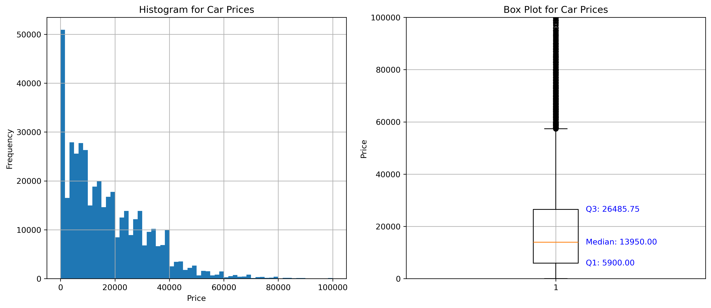

# Data-Driven Insights into Used Car Pricing

**Jupyter Notebook with code, experimentation, further insights, and deployment strategies: [here](https://github.com/er-robins/Used_Car_Price_Predication/blob/main/Used_Car_Price_Modelling.ipynb).**

## Business Goal

The used car market is a dynamic and mutifaceted industry that presents various opportunities and challenges for buisnesses and consumers. The Global used car market is substatial and continues to grow. In 2021, it was valued at approximately $1.5 trillion and is expected to grow at the CAGR of around 6% from 2022 to 2028. The U.S is one of the largest markets of used cars, with millions of vehicles sold annually. Recently during pandemic, used car market saw huge demand, bumping used car prices significantly. The Goal of this analysis is to develop a predictive model that can help guide consumers and delears in deciding appropriate pricing for the used cars. 

## Data

In this application, we explore a dataset from kaggle. The original dataset contained information on 3 million used cars. The provided dataset contains information on 426K cars to ensure speed of processing.  Our goal is to understand what factors make a car more or less expensive.  As a result of our analysis, we should provide clear recommendations to our client -- a used car dealership -- as to what consumers value in a used car.

## Modeling and performance

In this project, I employed various regression modeling techniques to predict used car prices. The models evaluated include `Linear Regression` and `Ridge Regression` with `polynomial features of Degree 2`. I also tried `Lasso Regression` and `Sequential Feature Selection`, though due to high computation cost they werent explored in detail, they can be good areas to expore in the future. Each model was trained and evaluated using a train/test split, followed by cross-validation and hyperparameter tuning using GridSearchCV to optimize performance. 

Among these, the Ridge Regression model demonstrated the best performance with a `Root Mean Squared Error (RMSE) of 6195.0590` and an` R-squared (R²) value of 0.7640`. 

To see the interactive plot of actual vs. predicted values, please click the link below:
[Actual vs. Predicted Values](https://github.com/er-robins/Used_Car_Price_Predication/blob/main/images/actual_vs_predicted.html)

### Evaluation Matric Choice :

I have used following two Matrics for evaluation.
1. **Root Mean Square Error (RMSE)**
   - **What is RMSE?**
     RMSE is a standard way to measure the error of a model in predicting quantitative data. Essentially, it tells you how concentrated the data is around the line of best fit.

   - **Why use RMSE?**
     - **Understandable Units:** RMSE values are in the same units as the predicted values. For example, if you are predicting the price of cars, an RMSE of 5000 means the average prediction error is about $5000.
     - **Error Sensitivity:** RMSE is especially good at identifying large errors because it squares the differences before averaging them. This means bigger errors have a disproportionately large impact on RMSE, highlighting problems in the model that might need attention.
     - **Clear Performance Indicator:** A lower RMSE value means the model has fewer and smaller errors, which is what you aim for. If you tweak your model and the RMSE goes down, it’s a sign you’re improving the model.

2. **Coefficient of Determination (R^2)**
   - **What is R^2?**
     R^2 measures how well your model’s predictions approximate the real data points. An R^2 of 1 indicates that the model perfectly predicts the data, while an R^2 of 0 means the model is no better than just predicting the mean of the data.

   - **Why use R^2?**
     - **Effectiveness of the Model:** R^2 gives you a quick insight into how much of the variance in the dependent variable your model can predict based on the independent variables.
     - **Comparison Tool:** It’s useful for comparing the strength of different predictive models. For instance, if one model has an R^2 of 0.80 and another has 0.90, you can say the second model has a better fit.
     - **Normalization:** Since R^2 is always between 0 and 1, it’s easy to interpret across different contexts and datasets, regardless of scale.

#### Matric choice summary :

- **RMSE** gives you a practical sense of how far off your model’s predictions might be in terms of dollars, which is directly applicable and easy to understand.
- **R^2** provides a percentage that tells you how much of the total variation in car prices your model captures, offering a way to gauge the model’s accuracy and usefulness.

Both metrics together provide a comprehensive view of the model’s effectiveness and areas for potential improvement, helping guide further refinements to enhance accuracy.

## Conclusion and Further Recommendations

Our analysis utilizing Ridge regression has yielded robust results, underlined by an RMSE of 6195.0590 and an R^2 value of 0.7640. These metrics confirm that our model achieves a substantial degree of predictive accuracy while capturing a significant portion of the variance within the dataset.

### Key Insights from the Analysis:

1. **Model Efficacy:**
   - The **R^2 value of 0.7640** indicates that approximately 76.40% of the variability in the target variable (car prices) is explainable by the features included in the model. This strong performance highlights the model's effectiveness in understanding and predicting car prices based on various vehicle characteristics.
   - An **RMSE of 6195.0590**, while substantial, is reasonable given the variability and range of car prices in the dataset. This measure provides a benchmark for expected prediction error and can be used to gauge individual predictions' accuracy.

2. **Influence of Vehicle Attributes:**
   - **Model Coefficients** have provided valuable insights into how different car models, conditions, and other features like mileage and age impact price evaluations. High-value models, such as luxury and performance vehicles, have shown a positive correlation with price, enhancing their valuation significantly.
   - The model also elucidates the depreciation effect through negative coefficients associated with higher `car_age` and `odometer` readings, though the positive coefficients for their squared terms suggest a tapering depreciation rate at higher values.

3. **Strategic Implications for Stakeholders:**
   - These insights are crucial for stakeholders in the automotive industry, including dealerships and manufacturers, to strategize inventory management, pricing policies, and marketing approaches. For instance, inventory strategies could be optimized to favor models that consistently show strong positive price influences.
   - Geographical and demographic data layers could further refine this model, potentially unveiling regional preferences that could impact pricing strategies.

### Recommendations for Model Enhancement:

To further enhance the predictive accuracy and utility of our model, the following steps are recommended:
- **Integrate Additional Data:** Including more granular data such as features specific to car luxury amenities, safety ratings, and consumer reviews could enrich the model's predictive context.
- **Explore Advanced Modeling Techniques:** Employing more complex algorithms or ensemble methods might capture additional nuances in the data.
- **Continuous Model Training:** Regular updates and training with new data will help the model adapt to market trends and changes, ensuring its relevance and accuracy over time.

### Final Thoughts:

The insights derived from this model provide a robust framework for understanding and predicting car values, offering actionable intelligence for business strategies. Continued refinement and adaptation to emerging data trends will enhance this model's precision and relevance in dynamic market conditions.

